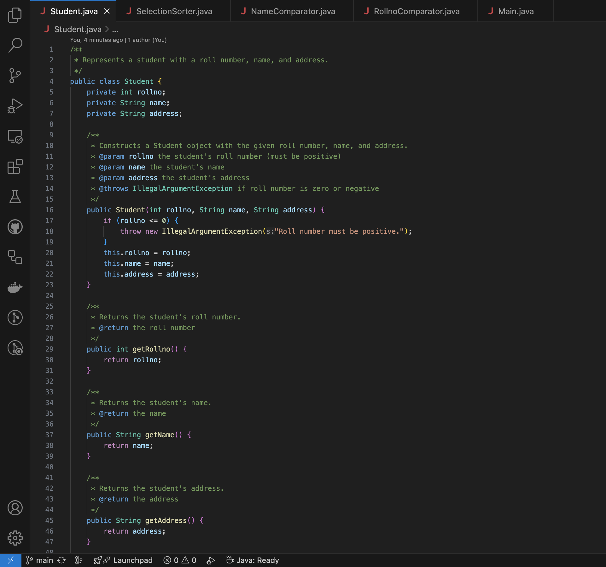
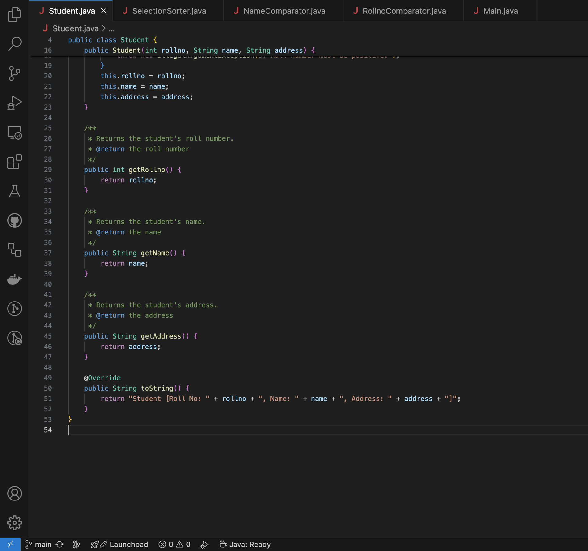
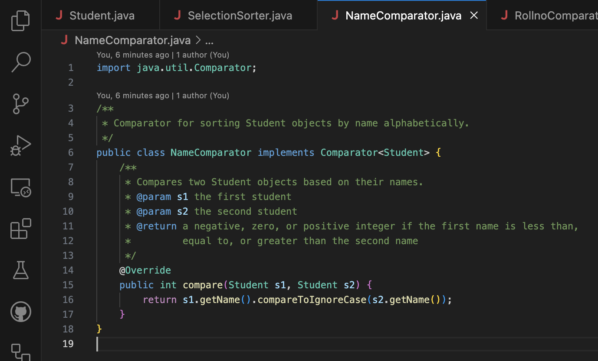
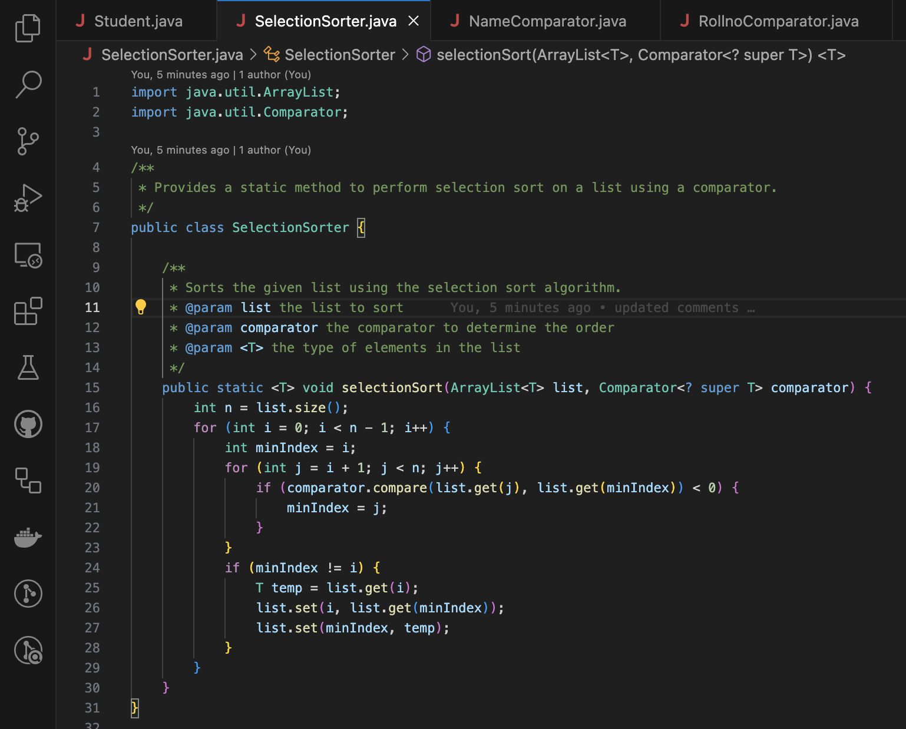
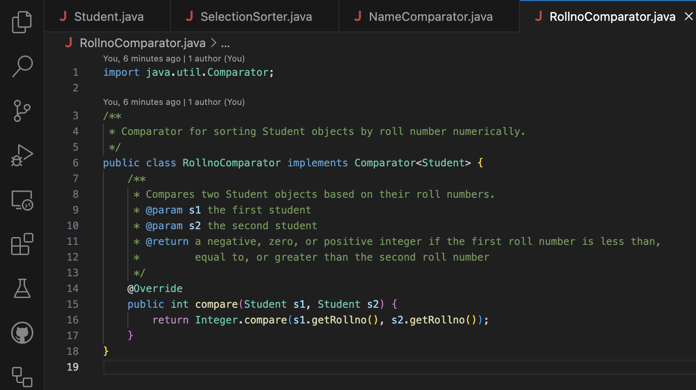
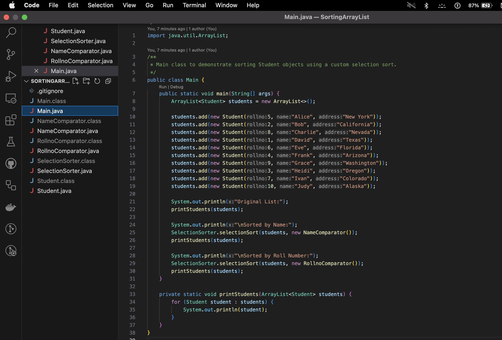
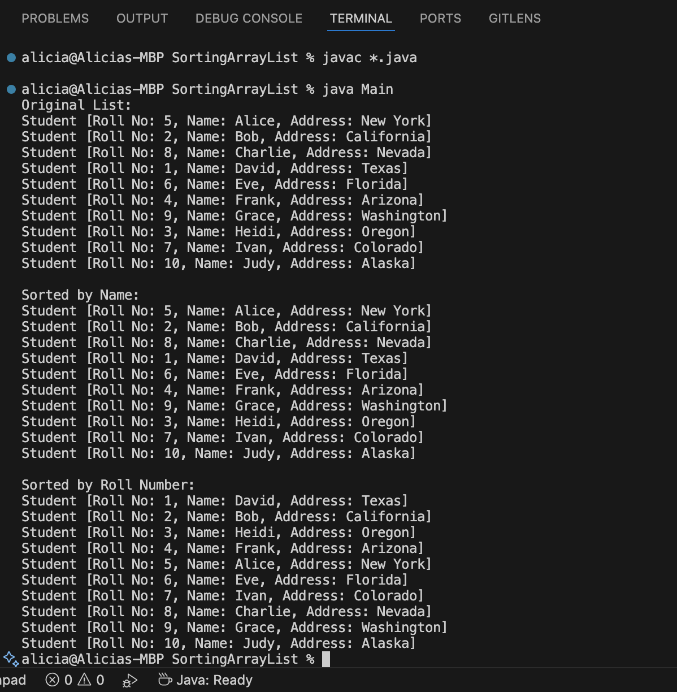

# SortingArrayList Project

This Java project demonstrates the use of an `ArrayList` to store `Student` objects and perform manual sorting using a custom `SelectionSorter` class.  
No Java Collections sort methods (`Collections.sort`, `Arrays.sort`, etc.) were used, as per assignment requirements.

## Features
- Stores 10 Student objects, each with roll number, name, and address.
- Sorts students alphabetically by name using a `Comparator`.
- Sorts students numerically by roll number using a `Comparator`.
- Implements custom selection sort algorithm without using built-in sort methods.
- Validates input to the `Student` constructor: roll number must be positive.
- Uses object-oriented programming principles with separation of concerns.

## Files
- `Student.java` — defines the Student class with input validation.
- `NameComparator.java` — comparator to sort by name.
- `RollnoComparator.java` — comparator to sort by roll number.
- `SelectionSorter.java` — custom selection sort implementation.
- `Main.java` — entry point for creating, displaying, and sorting students.

## How to Compile and Run
1. Open the project directory in Terminal.
2. Compile all Java files:
    ```bash
    javac *.java
    ```
3. Run the main program:
    ```bash
    java Main
    ```

## Source Code Screenshots

### Student.java Source Code



### NameComparator.java Source Code


### SelectionSorter.java Source Code


### RollnoComparator.java Source Code


### Main.java Source Code


## Program Output Screenshot

### Source Code Output
